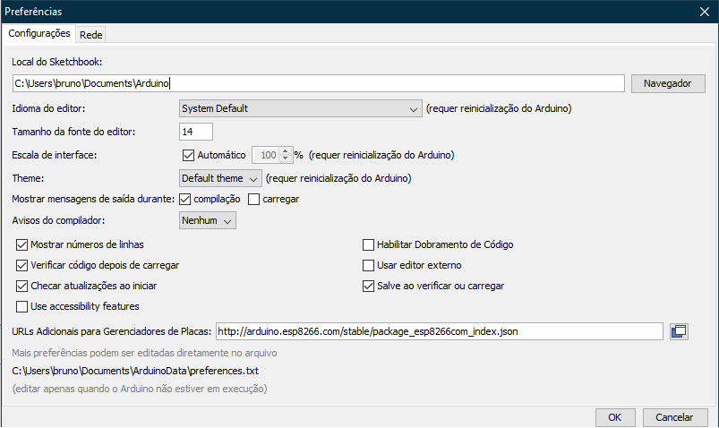
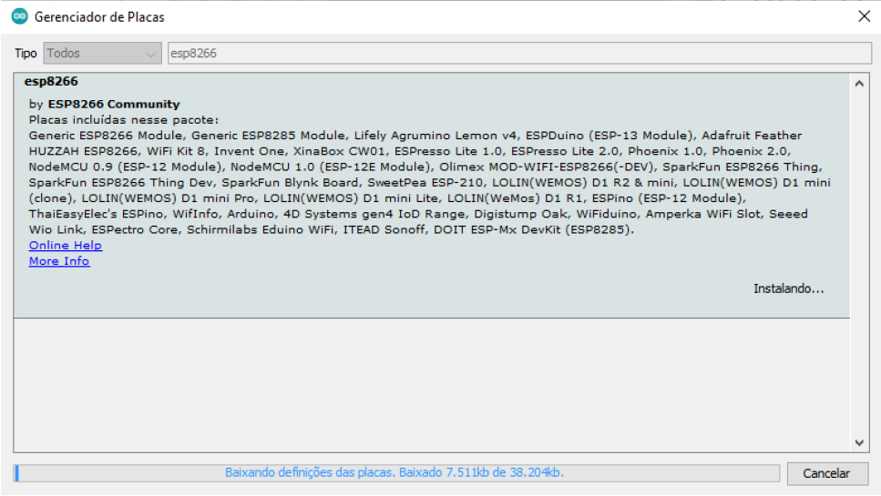
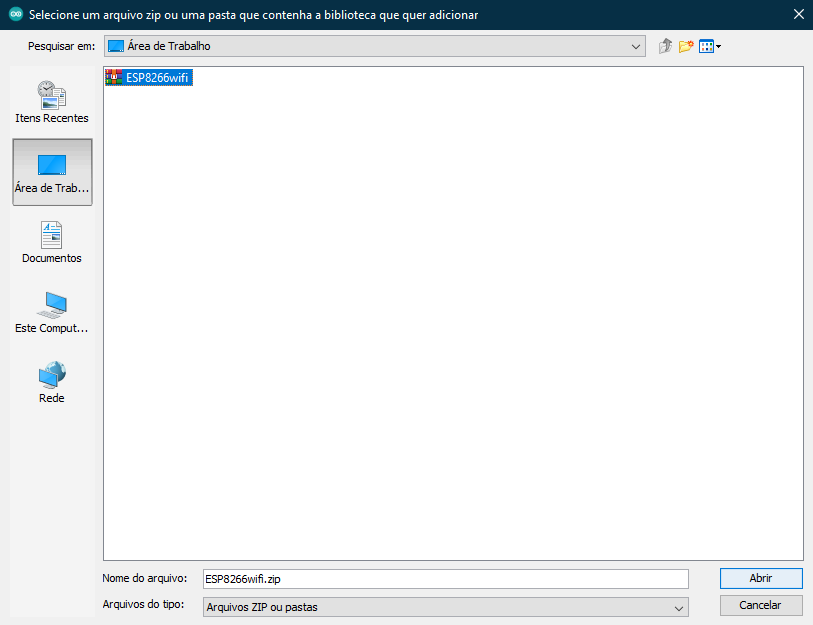
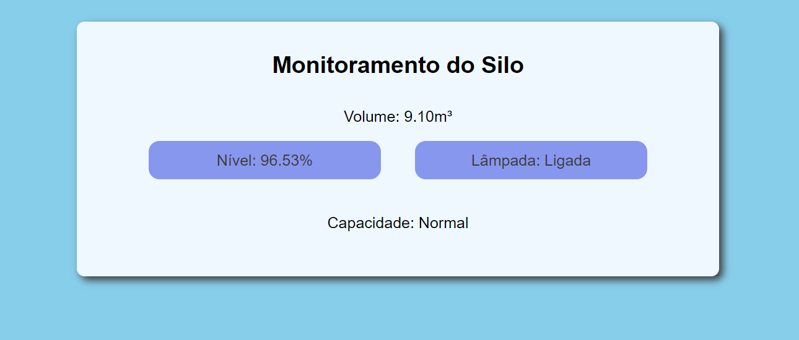

# # Monitoramento de Silo

### Atividade da matéria de IOT 2 - Faculdade UNISATC (SC) <p>

### Este código realiza funções de medição e atuações com base no nível de armazenamento do Silo e sua luminosidade interna.

#

## # Hardware Necessário

* Sensor Ultrassônico (HC-SR04)
* Sensor de Luminosidade (LDR)
* Protoboard
* ESP8266
* LED Vermelho, Verde e Azul (ou LED RGB)
* 3 resistores de 330R
* Cabos para conexão

#

## # Ligações no ESP8266 (respectivamente)

* LEDs (ou LED RGB) conectados em `D8, D9 e D10` (Azul, Verde e Vermelho)
* Sensor Ultrassônico conectado em `D6, D7, 5V e GND` (TRIGGER, ECHO, VCC e GND)
* Sensor LDR conectado em `A0, 3.3V e GND` (A0, VCC e GND)

#

## # E como que usa?
<p>

### Para executar esse código, foi utilizado a [IDE do Arduino](https://www.arduino.cc/en/software) com algumas personalizações, nas quais são:

<br>

* URL adicional para o Gerenciador de Placas, fazendo possível utilizar a biblioteca do ESP8266
```
http://arduino.esp8266.com/stable/package_esp8266com_index.json
```

<p align="center">
  <br>
</p>

* Inclusão da biblioteca ESP8266 em Ferramentas>Gerenciar Bibliotecas

<p align="center">
  <br>
</p>

* Download da biblioteca [<ESP8266WiFi.h>](http://www.martyncurrey.com/download/esp8266wifi-library/) e a inclusão da mesma em Sketch>Incluir Biblioteca>Adicionar Biblioteca .ZIP

<p align="center">
  <br>
</p>

#

## # Finalizando
<p>

### Após todos sses passos, basta rodar o código na IDE, quando ele terminar de compilar, abra o Console e desative a Auto-rolagem, logo irá aparecer o IP de sua máquina embaixo de [CONNECTED] (caso você já ter ajustado no código o campo `char ssid[]` e `char pass[]` com os dados de sua rede, caso contrário irá ficar conectando infinitamente).

#

<p style="font: normal 12pt Arial" align="center">
Com seu IP, basta jogar no navegador de seu celular o computador, e sucesso!
<p>

<p style="font: normal 12pt monospace" align="center">
Enjoy!
<p>

#

<p align="center">
  <br>
  Print do Navegador
</p>